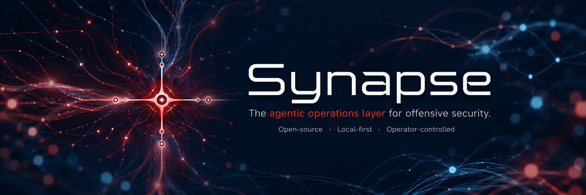

<p align="center">
  
</p>

<p align="center">
  
  
  
  
  
  
</p>

<p align="center">
  
  
  
</p>


Synapse is a local, workspace-centric MCP framework for operator-controlled
offensive security workflows. It maintains engagement state, organizes
evidence, tracks authorized scope, manages credential references, and
orchestrates security tooling through controlled MCP adapters.

It gives AI agents structured assessment context so they can
reason over normalized targets, services, endpoints, parameters, observations,
findings, evidence, and prior actions instead of fragmented tool output.

## Repository Index

Start here:

- [Quick Start](#quick-start): install the Python environment, run setup
  checks, and print MCP client config.
- [Example Workflow](#example-workflow): normal passive-first assessment flow.
- [Safety Model](#safety-model): scope, approval, credentials, evidence, and
  cleanup guardrails.
- [Documentation](#documentation): architecture, operations, reporting, adapter
  development, and MCP reference links.

Core project references:

- [Architecture](docs/Architecture.md): runtime topology, data flow, and
  boundary decisions.
- [Implementation Map](docs/Implementation-Map.md): module ownership, data
  layout, tool surface, and schemas.
- [Operations](docs/Operations.md): environment setup, operator procedures,
  jobs, credentials, cleanup, and tests.
- [Reporting Model](docs/Reporting-Model.md): internal Operator / High-Level
  report views and what they must not imply.
- [Synapse MCP](MCPS/Synapse-MCP/README.md): complete exposed tool list and MCP
  component notes.

Agent guidance:

- [AGENTS.md](AGENTS.md): concise repository-wide development policy, with
  scoped nested instructions under the MCP package. Runtime guidance is the
  separate packaged `synapse_mcp/operational_prompt.md`.
- [skills/](skills): agent skills for operating and developing Synapse,
  grouped by runtime — [skills/claude/](skills/claude) (`synapse-ops`,
  `synapse-dev`) and [skills/codex/](skills/codex) (router, coordinator,
  bootstrap, perimeter, web, access-control, CVE, reporting, and development
  playbooks). See [skills/README.md](skills/README.md) for install and
  validation steps.

## Why Synapse Exists

Security assessments produce scattered data across Burp traffic, terminal
output, OSINT services, notes, screenshots, reports, and repeated manual
decisions. That fragmentation makes AI assistance brittle: an agent can miss
what was already tested, forget scope, repeat noisy actions, or treat raw tool
output as confirmed evidence.

Synapse provides a local operational knowledge layer for authorized work. The
operator remains responsible for authorization, validation, impact assessment,
and final reporting; Synapse preserves context, normalizes evidence, and makes
prior assessment knowledge available through MCP tools and resources.

## What Synapse Is

- An MCP framework for AI-assisted offensive security.
- A workspace and evidence layer for authorized assessments.
- A controlled orchestration layer for selected security tools.
- A local file-backed context store that agents can query.
- A project structure that can evolve with an operator's methodology.

## What Synapse Is Not

- A fully autonomous pentesting agent.
- A vulnerability scanner by itself.
- A replacement for specialist tools such as Burp Suite, Nmap, FFUF, or SQLMap.
- A system intended to run active or high-impact actions without operator
  approval.
- A place to store secrets in notes, evidence, or reports.

## Modernization Status

Phase 5A–5B add a deterministic high-level capability-pack lifecycle around
the one canonical Action Registry. The default six-pack assembly preserves all
174 action IDs and legacy contracts; `--capability-pack core` starts a real
42-action modern core process without importing unselected implementations.
Native/generated descriptor providers no longer register through import side
effects, ownership is checked in
[`capability-pack-ownership.json`](docs/modernization/capability-pack-ownership.json),
and the selected catalog/Registry freeze before requests. Capability search
distinguishes high-level `capabilityPack` ownership from the stable action
namespace `pack`, filters canonical effects/availability/target/risk/
credential/task properties, and links on-demand pack methodology resources.
See the
[Phase 5 status](docs/modernization/phase-5-status.md).

Phase 4 is complete. Genuinely new workspaces now bootstrap transactionally in
SQLite-v2 after linked-runtime and filesystem readiness succeeds. Existing
JSON-v1 workspaces remain unchanged until an operator runs the separate
inventory, migration, verification, and activation steps; there is no
dual-write or migration deadline. Canonical bundle import selects v2 only after
semantic/artifact verification, while online backup, deterministic recovery
tests, and rollback refusal protect post-cutover truth. The reproducible
offline gate is `bin/run-phase4-acceptance`; see the
[Phase 4 handoff](docs/modernization/phase-4-handoff.md).

Phase 4D replaces only modern compact `context.query` with the typed,
revision-aware Context Compiler. It reads one committed repository snapshot,
separates facts/candidates/contradictions/gaps/actions/tasks/recommendations,
protects current scope and authority truth, supports exact `sinceRevision`
deltas, and accounts for the canonical UTF-8 context payload with explicit
omissions. Large evidence remains behind bound resource links. The frozen
legacy `workspace.prepare_target_context` action is unchanged. Current compact
application metadata is 23,482 bytes; the largest supported official-SDK wire
projection is 24,824 bytes, below the 24,834-byte gate.

Phase 5C adds shared operational work items for coordinator/specialist use in
activated SQLite-v2 workspaces. Work items are distinct from background jobs:
they carry bounded objectives, dependencies, atomic claim leases, progress,
handoffs, gaps, and workspace references. `tasks.control` keeps its existing job
and operation-handle behavior and adds `work.*` lifecycle operations without a
twelfth compact tool. Work-item-aware `context.query` supports bounded recovery
after chat/process loss, and linked active or unknown execution is never replayed
automatically. Coordination identity has no authority meaning. The compact
application descriptor is 23,297 bytes and the largest supported official-SDK
wire projection is 24,639 bytes, both under the 24,834-byte ceiling. Compact
schemas omit non-validating title/default/description annotations; runtime
defaults and validation remain unchanged.

Phase 5D adds a Codex-native operating package around that durable coordination
contract: one router, one coordinator, and six bounded bootstrap/perimeter/web/
access-control/CVE/reporting playbooks. Shared invariants require workspace
recovery, live capability discovery, passive/active separation, canonical
scope and server-held authority, conservative candidate semantics, explicit
completion/blocking, and evidence-backed handoff. The playbooks contain no
copied action catalog or schemas and add no provider-specific server behavior.
`bin/validate-codex-skills --check` detects stale metadata, missing shared
references, copied contracts, and contradictory authority/reporting language.

Phase 5E separates the 94-line repository policy from a 5,941-byte packaged
operational prompt, adds scoped MCP/policy/state/adapter/test instructions, and
ships Codex configs plus the complete skill/reference tree in wheel and sdist
artifacts. `bin/print-mcp-config` supports standard, core-only, direct
diagnostic, and legacy rollback profiles; `synapse-codex-assets` locates the
installed integration. See the
[Phase 5 distribution guide](docs/modernization/phase-5-distribution.md).

Phase 3C completes the production official-SDK adapter over the
protocol-independent modern application surfaces. Phase 3D is complete under
the operator-approved stable-Codex contract. Codex can use protocol-native
request state when negotiated or the typed `approval_required` plus opaque
`tasks.control` resume path on older revisions; both remain bound to trusted
server-held authority and exactly-once dispatch. No Anthropic account or
under-development Codex protocol feature is required. `modern-compact` stdio is
the Codex default and ADR-0004 is Accepted.

`synapse-mcp-modern` serves
either the eleven-operation `modern-compact` projection or the generated
174-operation `modern-direct` projection over stdio or authenticated
Streamable HTTP. The adapter pins official Python MCP SDK 2.0.0, negotiates MCP
`2026-07-28` and its supported earlier revision, persists bound operation and
artifact records, and uses rotating principal/audience-bound request-state
keys. Remote HTTP is disabled by default and fails startup without explicit
host/origin, authentication, persistent keyring, and TLS trust configuration.
The exact Phase 3D payloads are 99,337 bytes for legacy, 21,648 bytes for
compact, and 578,249 bytes for direct. See the
[Phase 3 handoff](docs/modernization/phase-3-handoff.md) for client evidence and
the reproducible three-run closure gate. The frozen legacy launcher remains an
independent rollback/bootstrap profile; modern direct remains explicit
diagnostic compatibility.

Phase 3B completed the protocol-independent modern application surfaces. The
eleven-operation compact facade provides engagement, context, catalog,
validated passive/active execution, reviews, opaque artifacts, reports, and
task control; the generated direct surface exposes all 174 canonical actions.
Both use the same Action Registry policy, authority, executor, continuation,
and ledger path. Compact application metadata is 21,648 bytes under the Phase
3 measurement, below the 24,834-byte gate.

Phase 3A established the canonical application boundary. All 174 frozen legacy
actions now enter Action Registry v2 by canonical `action_id`, validate typed
inputs and JSON-object outputs, resolve multidimensional effects and immutable
authorization intents, and expose one generated inventory for aliases,
availability, implementation identity, serializer ownership, and parity. Six
actions use native pack executors; the other 168 use a protocol-free bridge to
the retained implementation adapter, preserving per-action rollback. The
legacy 174-tool stdio surface remains the frozen compatibility rollback and
still uses its existing `confirm=true` gates.

Authority-aware execution now persists workspace-local grants, revisions,
step-ups, opaque request states, dispatch budgets, decisions, dispatch truth,
continuation bindings, and reconciliation under
`DATA/workspaces/<workspace>/authority/state.json`. One locked atomic
transaction evaluates an exact sealed plan and reserves its dispatch budget.
Covered `full_delegated` work executes without caller `confirm=true` or a new
pause; `supervised` returns an exact resumable step-up when required; uncovered
work does not dispatch. The local `synapse-authority` entry point manages this
state and is intentionally absent from model-executable actions. Authorization
identity excludes correlation/deadline metadata while the complete plan seal
retains it for audit integrity; idempotency keys cannot be reused for a changed
logical request or to bypass an unresolved dispatch.

The former three-action feasibility command now forwards to the production
adapter as a deprecated alias. Durable modernization decisions and current
gate evidence are indexed under
[`docs/modernization/`](docs/modernization/README.md).

## Main Features

### Workspace and operational memory

- Engagement-level workspaces with per-target normalized state: services,
  endpoints, parameters, observations, findings, actions, and evidence.
- Ingestion of Burp dumps, ffuf JSON, sitemap/crawler JSON, nmap XML, Shodan
  summaries, Nuclei JSONL, adapter results, and operator notes — stored as raw
  evidence, parsed, normalized, and deduplicated per target.
- Compact target context (`workspace.prepare_target_context`) so an AI client
  plans from what is already known instead of re-deriving it.
- Finding lifecycle with explicit operator-review state: `candidate`, `confirmed`,
  `false_positive`, `accepted_risk`, `fixed`, with evidence linking and
  report-ready export.

### Scope, approval, and credential safety

- Persisted authorization scope (hosts, patterns, CIDRs) at global and
  workspace level; active adapters validate against the owning workspace's
  scope before the global file.
- Scope and execution authority are separate gates. The legacy profile requires
  in-scope validation plus `confirm=true`. Authority-aware profiles ignore that
  caller field as authority, evaluate durable grants immediately before
  dispatch, and return typed `input_required` state when uncovered.
- Scoped credentials (`bearer`, `basic`, `cookie`, `header`, browser-derived
  `session`) stored locally with `0600` permissions, redacted in every
  response, and resolved per request target. Browser authentication profiles
  (Playwright or Selenium Remote) handle SSO, MFA, and device-approval flows.
- Evidence events are sanitized for secret-bearing fields and embedded
  secret-bearing strings before they are written.

### Passive intelligence

- Burp-like site maps and workflow graphs (JSON plus Mermaid/SVG flowcharts)
  from offline dumps without sending traffic.
- Active crawls preserve cross-host links, redirects, form actions, and
  JavaScript references as `asset_relation` observations. Assets outside the
  owning workspace scope are mapped but not fetched; the operator can review
  those relations before expanding or excluding scope.
- Rich request/response context extraction: parameters, JSON field paths,
  cookie names, authorization schemes, redirects, forms, API/JSON/GraphQL
  signals, authentication boundaries, state-changing methods, and error
  signals.
- Workspace fingerprinting into structured technology components with name,
  version, layer, confidence, evidence sources, and synthesized CPEs with
  explicit version precision.
- External-perimeter inventory: host assets, web applications, technology
  matrix, canonical login portals, protected resources, and request-aware
  review candidates.
- Shodan and InternetDB results normalize per discovered asset rather than
  attaching every service to the query seed. DNS/asset relations, TLS, HTTP,
  CPE, provider CVE metadata, and port inventories survive compact or raw
  response modes.
- Passive candidate analyzers for SQLi, XSS, SSRF, open redirect, command
  injection, SSTI, LFI/RFI, SSI, access control, CSRF, CORS, XXE, GraphQL,
  insecure deserialization, security headers/cookies, JWT, and TLS posture.
- Passive OpenAPI/Swagger/Postman spec import that normalizes documented
  endpoints, parameters, and auth schemes without sending traffic.

### JavaScript intelligence

- JS asset discovery from stored workspace data, approved bounded fetching,
  and static analysis (no JavaScript execution): API endpoints, methods, API
  bases, GraphQL operations, WebSocket URLs, storage keys, auth/CSRF header
  names, and object identifiers.
- JS-inferred endpoints normalized as `derived`/`inferred` records that never
  overwrite observed traffic, plus JS-enriched application maps as HTML,
  Markdown, or JSON.

### Guarded active adapters and background jobs

- Bounded active crawling (including authenticated extended POST-form
  mapping), constrained ffuf and adaptive Nuclei profiles, and nmap profiles.
- Bounded, operator-approved single-shot HTTP probes for XSS, SSRF, open
  redirect, command injection, SSTI, LFI/RFI, SSI, XXE, CORS, and GraphQL
  introspection, plus approved access-control matrix replay across credential
  contexts. Every active probe is scope-checked and bounded by adapter-specific
  safety policy; the stable legacy profile remains `confirm=true` gated, while
  migrated authority-aware actions consume trusted grant receipts. XSS validation defaults to an
  inert reflection-only marker; syntax-breakout and execution-capable payloads
  require explicit modes and higher risk tiers.
- CVE intelligence and verification: approval-gated correlation of
  fingerprinted components against multiple online sources (NVD, CISA KEV,
  public PoC indexes, Shodan) into candidate CVEs with applicability confidence
  and exploit maturity (known-exploited / public PoC / referenced / none);
  one-click confirmed benign replay or delegation to a Nuclei template to
  verify a candidate; and bounded active version probing to raise fingerprint
  precision. Source endpoints are config-driven and can be re-pointed at
  runtime. Provider/query-hash responses are shared across targets under the
  local DATA cache, while each target retains its own evidence reference.
  Cross-process token buckets coordinate each source and credential tier,
  honor `Retry-After`, and expose bounded retry/pause state; only
  product/version/CPE/CVE identifiers ever leave the workspace.
  Template-bearing sources are validated at MCP startup, in `cve.sources`, and
  before correlation. Invalid templates are disabled with a configuration
  error and cannot send a request; PoC paths accept only strict CVE IDs and the
  explicit `{year}/{cveId}.json` fields.
  Run-level `sourceStatus` remains aggregate provider health; candidates carry
  only their exact per-query `sourceResults` with normalized query hash,
  resolved URL, HTTP status, stable result ID, and target-local evidence ID.
- Version-unknown components produce explicit precision gaps and skip broad
  NVD correlation by default. `includeVersionUnknown=true` is an opt-in broad
  run, and only externally corroborated KEV/PoC/exploit leads survive it.
- Version applicability and deployment applicability are separate. NVD
  configuration CPEs and explicit advisory preconditions are compared with
  independent workspace OS, web-server, module, CGI/code-path, and
  configuration evidence. Contradictions are retained as non-reportable
  refutations; unknown controlling facts lower confidence, emit a prerequisite
  gap, and block direct replay until the reachable affected path is identified.
- Long-running tools run as workspace-scoped background jobs by default with
  durable `jobs.list` / `jobs.status` / `jobs.cancel` records that survive MCP
  restarts. Every new job fixes its continuation lineage and effect envelope at
  creation; lazy status refresh can finalize, ingest, log evidence, and clean
  sidecars once without requesting the same approval again. A separate internal
  snapshot read performs none of those effects.
- The stdio transport applies bounded per-call deadlines so a slow synchronous
  call returns a recoverable JSON-RPC error instead of stalling the server.

### Reporting and documentation

- Seven normalized passive report layers (perimeter, JavaScript,
  authentication, access control, web vulnerabilities, CVE exposure, and
  engagement coverage) with a shared structure: summary, sections, per-target
  context, coverage gaps, and recommended next steps.
- Single-layer and all-layer workspace reports as Markdown, JSON context, or
  self-contained HTML with inline assets and no external runtime dependency.
- Report, finding-draft, evidence-pack, coverage, and assessment-summary
  contexts. HTML reports are internal operator artifacts with Operator /
  High-Level presentation views. Public modes `operator`, `operator_raw`, and
  `high_level` map centrally to compatibility policies while render metadata
  reports both names. Report generation never sends active traffic.

## Mental Model

```text
Operator / AI client
        |
        v
MCP boundaries
|-- Burp MCP        optional live Burp Suite state and UI/session operations
`-- Synapse MCP     local policy, workspace memory, evidence, and adapters
    |-- scope and approval gates
    |-- normalized workspace entities
    |-- evidence and credential references
    |-- passive analyzers and documentation contexts
    `-- guarded active adapters with background jobs
```

Synapse supports two MCP boundaries:

- `synapse`: the local Synapse MCP for policy, state, evidence, and adapters.
  This is the required operational endpoint.
- `burp`: PortSwigger's official Burp MCP stdio proxy launcher, optional but
  highly recommended for live Burp Suite state and UI/session operations.

See [Architecture](docs/Architecture.md) for the full runtime topology, data
flow, and boundary decisions.

## Core Concepts

| Concept | Purpose |
| --- | --- |
| Scope | Persisted authorization allowlist for hosts, patterns, and CIDRs. |
| Workspace | Engagement-level state under `DATA/workspaces/<workspace-id>/`. |
| Target | Per-host normalized state: services, endpoints, parameters, findings, actions, observations. |
| Evidence | Raw local artifacts plus global and host-indexed JSONL event logs. |
| Observation | A hypothesis or lead produced by parsing, passive analysis, OSINT, or workflow mapping. |
| Finding | Lifecycle-managed issue with status, severity, confidence, evidence IDs, impact, remediation, and explicit operator-review state. Deterministic passive facts may enter as `operatorReviewed=false`. |
| Action | Recorded passive or active tool activity for a target. |
| Credential | Scoped HTTP secret stored locally and referenced by `credentialId`; responses are redacted. |
| Background Job | Workspace-scoped long-running tool record polled through `jobs.*`. |
| Fingerprint | Passive technology and host-behavior summary from dumps or normalized workspace data. |
| Perimeter | Passive inventory of assets, technologies, web apps, login portals, protected resources, and review candidates. |
| Documentation Context | Structured report, finding, evidence-pack, coverage, layer, or all-workspace model built from workspace data before rendering. |

## Quick Start

Required:

- Python 3.10+ as `python3`
- A repository virtual environment for Synapse MCP runtime dependencies.
- An MCP client that can launch stdio servers, such as Codex

Recommended optional tooling:

- Playwright Chromium for browser-assisted authentication flows.
- `sqlmap`, `ffuf`, `nuclei`, and `nmap` for the matching adapter workflows.
- Java for `MCPS/Burp-Mcp/mcp-proxy.jar`
- Burp Suite with PortSwigger's MCP Server extension enabled
- PortSwigger's Burp MCP proxy launcher under `MCPS/Burp-Mcp/`

1. Create and populate the Synapse virtual environment from the repository
   root:

   ```bash
   python3 -m venv .venv
   . .venv/bin/activate
   python -m pip install -U pip
   python -m pip install -e '.[browser,modern,state-v2]'
   python -m playwright install chromium
   ```

2. Run the setup check, which validates required Synapse prerequisites and
   reports legacy and modern readiness independently:

   ```bash
   bin/check-setup
   bin/check-state-v2-readiness
   ```

   Missing external scanner binaries are warnings by default because passive,
   offline, reporting, and static-analysis workflows still work without them.
   Modern readiness fails until private identity bindings, a request-state
   keyring, a writable state directory, and a resolvable binding are present.
   Use `bin/check-setup --legacy` when validating only the frozen rollback.
   The separate State Store v2 probe prints the actual linked SQLite versions
   and requires SQLite 3.51.3 or later. It does not migrate or activate an
   existing workspace. The Task 4A repository, migration, revision, online
   backup, and content-addressed artifact foundations now back new workspaces
   by default. Existing JSON-v1 workspaces remain on v1. Use `bin/state inventory`, `migrate
   --dry-run`, `migrate --apply`, `verify`, and the separate `activate`
   command for a guarded Task 4B cutover; migration never activates implicitly.
   Stop the MCP service during cutover. Before shipping state changes, run the
   private, disabled-traffic `bin/run-phase4-acceptance` gate.

3. For a full active-adapter workstation, require scanner binaries too:

   ```bash
   bin/check-setup --strict-tools
   ```

4. Print the MCP client config without running checks:

   ```bash
   bin/print-mcp-config --standard
   ```

Codex should normally use the standard modern compact command emitted by
`bin/print-mcp-config`. Use `--core-only` for the 42-action core selection,
`--modern-direct` for diagnostic compatibility, and `--legacy` only for
rollback/bootstrap compatibility. Runtime selection consistently honors
`SYNAPSE_PYTHON`, an active `VIRTUAL_ENV`, then the repository `.venv`, and
fails instead of printing a nonexistent interpreter.
Runtime data stays under `SYNAPSE_ROOT/DATA` by default. Shodan API keys are
never stored in config — set them only at runtime with
`shodan.session_key.set`.

Optional Burp MCP support is not required for Synapse MCP, offline dump
analysis, workspace memory, passive triage, or reports. Install it only when
you need live Burp Suite state such as proxy history, Repeater, or UI/session
interactions.

See [Operations](docs/Operations.md) for environment details, timeout knobs,
and the full operator procedures.

## Example Workflow

```text
1. Start an assessment workspace with authorized scope.
2. Import passive Burp traffic or run approved crawl/recon.
3. Poll any background jobs to completion with `jobs.status`.
4. Normalize endpoints, parameters, services, observations, and evidence.
5. Run or review workspace fingerprinting.
6. Refresh perimeter summary/report.
7. Prepare compact target context for an AI assistant.
8. Run deeper approved validation only when the passive picture justifies it.
9. Review candidate observations and promote validated issues into findings.
10. Link evidence and export report-ready contexts.
```

Example MCP tool call:

```json
{
  "tool": "project.start",
  "arguments": {
    "organization": "Client",
    "workspaceId": "client-web-2026",
    "hosts": ["app.example.com"],
    "notes": "External web assessment scope"
  }
}
```

## MCP Tool Surface

The authoritative runtime schemas live in
`MCPS/Synapse-MCP/synapse_mcp/transport/stdio_server.py`; the complete,
test-guarded tool list is maintained in
[MCPS/Synapse-MCP/README.md](MCPS/Synapse-MCP/README.md). At a high level,
Synapse exposes tools for:

- Adapter discovery: `adapters.list`, `adapters.capabilities`.
- Project, scope, workspace, evidence, credentials, and findings lifecycle.
- Background jobs: `jobs.list`, `jobs.status`, `jobs.cancel`.
- Offline dumps, cache inspection, passive sitemap generation, and workflow
  graph artifacts.
- Workspace fingerprinting, external-perimeter analysis, and perimeter report
  rendering.
- JavaScript intelligence and JS-enriched app-map reports.
- Documentation contexts and internal Markdown/JSON/HTML exports.
- Web assessment adapters: crawler, ffuf, Nuclei, SQLi/XSS triage, SSRF, open
  redirect, command injection, SSTI, LFI/RFI, SSI, access control, CSRF, CORS,
  XXE, GraphQL, insecure deserialization, security headers/cookies, JWT, TLS
  posture, and OpenAPI/Swagger/Postman spec import.
- CVE intelligence and verification: `cve.correlate`, `cve.plan_tests`,
  `cve.prepare_replay`, `cve.execute_test`, runtime source-endpoint recovery
  (`cve.sources`, `cve.set_source_endpoint`), and `fingerprint.probe_versions`.
- Infrastructure and OSINT adapters: nmap and Shodan.

Crawler job process status and assessment coverage are reported separately.
A successfully finalized worker can retain `status=completed` while
`resultDisposition` is `complete`, `partial`, or `no_coverage`; compact job
summaries include request, response, successful-fetch, visited, blocked-
redirect, queued, and categorized error counts.

Representative entity and event schemas are documented in the
[Implementation Map](docs/Implementation-Map.md).

## Adapter Framework

Synapse adapters are modular assessment components that plug into the
workspace, evidence, scope, credential, action, and finding lifecycle. Each
adapter declares its metadata, capabilities, risk model, traffic behavior, and
output types, so organizations can build their own methodology on top of
Synapse without modifying the core framework.

- [Adapter Development](docs/Adapter-Development.md)
- [Custom Adapter Template](examples/custom_adapter_template/README.md)

## Workspace Data Layout

Runtime data is local and file-backed under `DATA/`:

```text
DATA/
|-- scope/scope.json                  global hosts, patterns, CIDRs, and notes
|-- credentials/credentials.json      scoped credential store (0600)
|-- evidence/                         global and host-indexed event logs
`-- workspaces/<workspace-id>/
    |-- workspace.json                engagement metadata and target index
    |-- scope.json                    workspace-owned scope snapshot
    |-- jobs/<job-id>/job.json        background job records
    |-- outputs/                      workspace-level generated outputs
    `-- targets/<host>/
        |-- entities/                 services, endpoints, parameters,
        |                             findings, actions, observations
        |-- models/                   perimeter and access-control models
        |-- outputs/                  tool and JS-intelligence outputs
        `-- evidence/                 raw artifacts and Burp dumps

reports/<workspace-id>/               local internal reports, batch manifests,
                                      report runs, and decision archives
```

The full annotated layout is in the
[Implementation Map](docs/Implementation-Map.md). Runtime data under `DATA/`
is ignored by git except for `.gitkeep` placeholders.

## Safety Model

Synapse is designed for authorized security assessments and keeps the operator
in control:

- Work only on systems the operator is authorized to test.
- Scope and execution approval are separate gates; active traffic requires
  in-scope validation and `confirm=true`, checked against the owning
  workspace's persisted scope first.
- Passive/offline ingestion may retain out-of-scope data, but it always
  reports `scopeStatus` and warnings instead of hiding authorization state.
- Credentials are scoped to authorized hosts and returned redacted; evidence
  events are sanitized for secrets before writing.
- Tool outputs default under workspace folders. Rendered reports default under
  `reports/<workspace>/`; paths outside the shared reports root
  require `allowExternalOutput=true`.
- Cleanup of dumps and generated artifacts is inspect-first and
  confirm-before-delete.
- SQLMap execution is not exposed; only offline analysis and guarded command
  generation are available. Command-injection execution is limited to approved
  benign marker requests.

The complete safety model, including credential, browser-session, and
evidence-sanitization guarantees, is documented in
[Architecture](docs/Architecture.md).

## Documentation

- [Documentation Index](docs/README.md)
- [Architecture](docs/Architecture.md): boundaries, data flow, safety model.
- [Implementation Map](docs/Implementation-Map.md): modules, tool surface,
  data layout, workflows, schemas.
- [Reporting Model](docs/Reporting-Model.md): internal report views, the
  presentation toggle, and what reports must not do.
- [Operations](docs/Operations.md): setup, operator procedures, cleanup,
  tests.
- [Adapter Development](docs/Adapter-Development.md)
- [Synapse MCP](MCPS/Synapse-MCP/README.md): complete tool list and adapter
  policy.
- Burp MCP notes under `MCPS/Burp-Mcp/README.md` when the optional launcher is
  installed.

## Project Hygiene

- [Contributing](CONTRIBUTING.md)
- [Security Policy](SECURITY.md)
- [License](LICENSE)

## Testing

Run all repository tests:

```bash
bin/test
```

Useful focused modes:

```bash
bin/test --core
bin/test --template
bin/test --core -k access_control
bin/test-modern # after: pip install -e '.[modern,state-v2]'
bin/check-state-v2-readiness
```

The suite covers adapter analysis, credential safety, evidence redaction,
workspace ingestion and deduplication, passive Burp context parsing, candidate
analyzers, JS intelligence extraction/reporting, finding lifecycle operations,
active-tool ingestion hooks, MCP dispatch, and the custom adapter template.
The separate modern command runs the pinned production official-SDK adapter
suite across stdio and loopback Streamable HTTP; it is also an isolated CI job.

## Authorized Use Notice

Synapse is intended for authorized security testing, internal research, and
defensive assessment workflows. Do not use it against systems you are not
authorized to test. The operator is responsible for scope, approval,
validation, and compliance with applicable laws and engagement rules.

## License

Synapse is licensed under the Apache License, Version 2.0.

See [LICENSE](LICENSE) for the full license text and [NOTICE](NOTICE) for
attribution and third-party notices.
